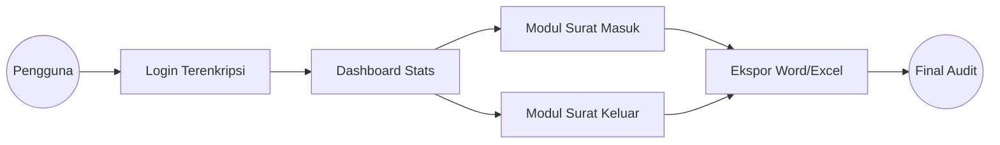

# Panduan Presentasi Lengkap: Aplikasi Persuratan "Premium Edition"

Dokumen ini disusun untuk memberikan performa presentasi terbaik bagi laporan magang Anda.

## Arsitektur Alur Surat (Mermaid Diagram)
Gunakan diagram ini di slide Presentasi Anda untuk menjelaskan cara kerja sistem:

---

## Detil Konten Slide & Naskah Presentasi (Script)

### Slide 1: Judul
*   **Visual:** Background gambar kantor atau logo instansi dengan filter gelap.
*   **Script:** "Selamat pagi/siang Bapak/Ibu sekalian. Saya [Nama Anda] akan mempresentasikan hasil pengembangan Sistem Aplikasi Persuratan yang saya bangun selama masa magang di DISDIKPORA JEPARA."

### Slide 4: Tech Stack (Teknis)
*   **Visual:** Ikon Laravel, PostgreSQL, dan Tailwind CSS dalam tata letak yang bersih.
*   **Script:** "Aplikasi ini tidak dibangun dengan sekadar HTML biasa. Saya menggunakan Laravel 10 untuk keamanan data, didukung oleh Supabase untuk database cloud, sehingga data dapat diakses oleh admin dari manapun dengan aman."

### Slide 8: Pelaporan Ekspor Premium (Highlight!)
*   **Visual:** Tunjukkan perbandingan screenshot data di tabel VS hasil ekspor file MS Word yang rapi dengan Kop Surat.
*   **Script:** "Inilah fitur unggulan aplikasi ini. Sistem secara otomatis menghasilkan file Word yang sudah memiliki Kop Surat standar instansi. Jadi, staf tidak perlu lagi mengatur margin atau format secara manual."

---

## Daftar Fitur Lengkap untuk Dijabarkan
Jika penguji bertanya "Apa saja yang bisa dilakukan aplikasi ini?", gunakan daftar ini:

1.  **Smart Dashboard**: Menampilkan total surat secara dinamis tanpa perlu refresh halaman.
2.  **CRUD Management**: Mencakup penambahan, pengeditan, penghapusan, dan pencarian data surat masuk & keluar.
3.  **Automatic Agenda Numbering**: Sistem otomatis memberikan nomor urut pada surat keluar agar tidak ada nomor ganda.
4.  **Premium Export Engine**: Menggunakan library `PHPWord` dan `PHPSpreadsheet` untuk menghasilkan dokumen legal yang siap cetak.
5.  **Role-Based Security**: Mengatur siapa yang bisa menambah data dan siapa yang hanya bisa melihat (View-only).
6.  **Responsive UI**: Dapat diakses melalui HP untuk memantau surat yang masuk meskipun admin sedang di luar kantor.

---

## Tips Presentasi "WOW"
1.  **Demo Langsung**: Jika memungkinkan, tunjukkan proses menambahkan surat dan langsung klik tombol "Ekspor Word". Kecepatan sistem menghasilkan dokumen surat akan sangat memukau penguji.
2.  **Jelaskan Masalah**: Tekankan betapa sulitnya mencari surat di tumpukan kertas sebelum aplikasi ini ada.
3.  **Visualisasi**: Gunakan screenshot aplikasi Anda yang terbaru (yang sudah memiliki desain premium).

---

### Update File Terakhir:
Semua file ini (termasuk versi teks untuk PowerPoint) sudah saya siapkan dan salin ke folder kerja Anda di `c:\laragon\www\aplikasi-persuratan`.
